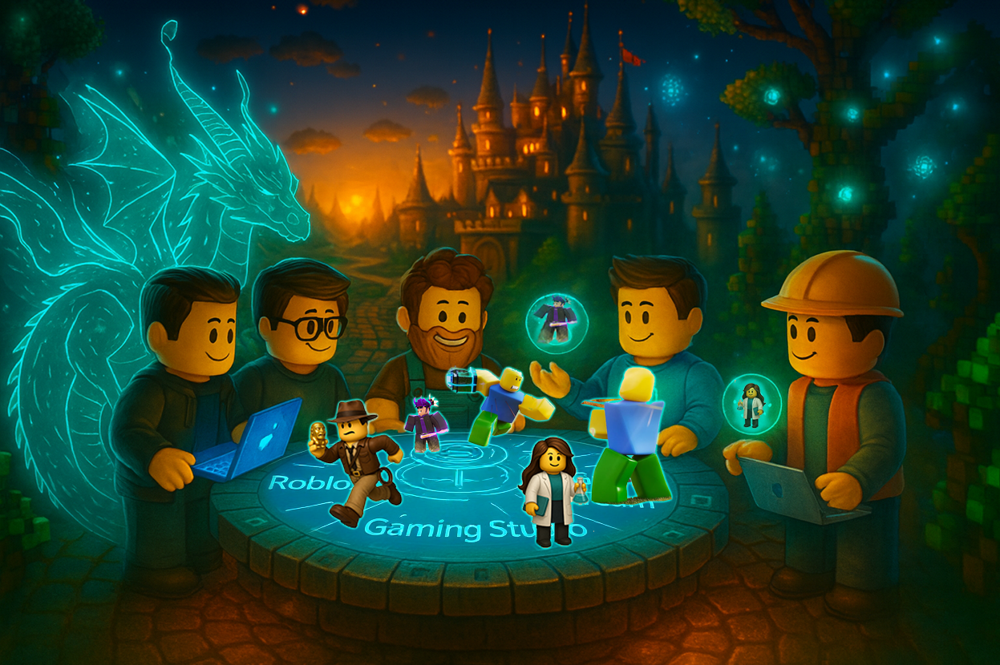

# Blox Buddy Landing Page

> **A free, curated learning roadmap** that organizes the best existing YouTube tutorials, resources, and AI tools into a clear, progressive path for young Roblox developers.



## 🚀 Live Demo

- **Development Server**: http://localhost:3002
- **GitHub Repository**: https://github.com/Agentic-Person/BloxBuddy

## ✨ Features

### 🎨 Modern Design
- **Hero Background**: Features the BuildersRoundTable.png image
- **Purple-to-Blue Gradient**: Smooth gradient flowing throughout the page
- **Glass Morphism Effects**: Modern frosted glass UI elements
- **Responsive Design**: Mobile-first approach with perfect scaling

### 🎭 Advanced Animations
- **Framer Motion Integration**: 60fps smooth animations
- **Scroll-Triggered Effects**: Content reveals as you scroll
- **Accessibility Support**: Respects `prefers-reduced-motion`
- **Interactive Hover States**: Micro-interactions for better UX

### 🧩 Component Architecture
- **Navbar**: Fixed navigation with smooth scroll and active states
- **Hero**: Image background with animated headlines and CTAs
- **WhatIsBloxBuddy**: Educational cards with alternating 40-20-40 layout
- **CTASection**: Call-to-action with animated buttons and effects
- **Footer**: Social links, newsletter signup, and company info

## 🛠️ Tech Stack

### Core Technologies
- **React 19** - Latest React with TypeScript
- **TypeScript** - Type-safe development
- **Tailwind CSS** - Utility-first styling
- **Framer Motion** - Production-ready animations

### Development Tools
- **Create React App** - Fast development server
- **PostCSS** - CSS processing
- **React Icons** - Comprehensive icon library

### Dependencies
```json
{
  "react": "^19.1.1",
  "react-dom": "^19.1.1",
  "framer-motion": "^12.23.12",
  "react-icons": "^5.5.0",
  "tailwindcss": "^3.4.17"
}
```

## 🏗️ Project Structure

```
src/
├── components/           # React components
│   ├── Navbar.jsx       # Fixed navigation bar
│   ├── Hero.jsx         # Hero section with background image
│   ├── WhatIsBloxBuddy.jsx  # Educational content cards
│   ├── CTASection.jsx   # Call-to-action section
│   ├── Footer.jsx       # Footer with links and newsletter
│   └── SmoothScrollProvider.jsx  # Smooth scroll context
├── utils/
│   └── animations.js    # Framer Motion variants and utilities
├── App.tsx              # Main application component
└── index.css            # Global Tailwind imports
```

## 🚀 Getting Started

### Prerequisites
- Node.js 16+ 
- npm or yarn package manager

### Installation

1. **Clone the repository**
   ```bash
   git clone https://github.com/Agentic-Person/BloxBuddy.git
   cd BloxBuddy/blox-buddy-app
   ```

2. **Install dependencies**
   ```bash
   npm install
   ```

3. **Start development server**
   ```bash
   npm start
   # or for custom port
   PORT=3002 npm start
   ```

4. **Open in browser**
   ```
   http://localhost:3000 (or 3002)
   ```

## Available Scripts

### `npm start`
Runs the app in development mode. Open [http://localhost:3000](http://localhost:3000) to view it in the browser.

### `npm test`
Launches the test runner in interactive watch mode.

### `npm run build`
Builds the app for production to the `build` folder with optimized performance.

### `npm run eject`
**Note: this is a one-way operation!** Ejects from Create React App configuration.

## 🎨 Design System

### Color Palette
```css
/* Primary Brand Colors */
--blox-teal-light: #4AC4E8
--blox-teal: #36B0D9
--blox-teal-dark: #2A8CB0

/* Background Colors */
--blox-very-dark-blue: #001D39
--blox-second-dark-blue: #002246
--blox-black-blue: #001C38

/* Text Colors */
--blox-white: #FFFFFF
--blox-off-white: #DDDDDD
```

### Gradients
- **Purple-to-Blue**: `linear-gradient(180deg, #4C1D95 0%, #1E3A8A 50%, #001D39 100%)`
- **Teal Gradient**: `linear-gradient(135deg, #36B0D9 0%, #1782AC 100%)`
- **Dark Gradient**: `linear-gradient(135deg, #001D39 0%, #002246 100%)`

## 🎭 Animation System

### Performance Features
- **Hardware Acceleration**: CSS `will-change` optimization
- **Reduced Motion**: Respects accessibility preferences
- **Staggered Animations**: Coordinated component reveals
- **Scroll Integration**: useScroll and useTransform hooks

### Key Animation Variants
```javascript
// Fade in with scale
scaleIn: {
  hidden: { opacity: 0, scale: 0.9 },
  visible: { opacity: 1, scale: 1 }
}

// Slide up animation
fadeInUp: {
  hidden: { opacity: 0, y: 30 },
  visible: { opacity: 1, y: 0 }
}

// Staggered container
staggerContainer: {
  visible: { transition: { staggerChildren: 0.1 } }
}
```

## 📱 Responsive Design

### Breakpoints
- **Mobile**: 0px - 640px
- **Tablet**: 641px - 1024px  
- **Desktop**: 1025px+

### Key Features
- Mobile-first CSS approach
- Touch-optimized interactions
- Fluid typography scaling
- Optimized image delivery

## 📋 Project Roadmap

See [TODO.md](./TODO.md) for detailed roadmap and upcoming features.

### Immediate Next Steps
- [ ] Replace placeholder content with real copy
- [ ] Add functional newsletter signup
- [ ] Implement proper SEO meta tags
- [ ] Add analytics tracking
- [ ] Create additional content pages

## 🤝 Contributing

1. Fork the repository
2. Create a feature branch: `git checkout -b feature/amazing-feature`
3. Commit changes: `git commit -m 'Add amazing feature'`
4. Push to branch: `git push origin feature/amazing-feature`
5. Open a Pull Request

## 📄 License

This project is part of the Blox Buddy educational platform.

## 📞 Contact

- **GitHub**: https://github.com/Agentic-Person/BloxBuddy
- **Project Focus**: Roblox learning platform for young developers

---

## 🎯 About Blox Buddy

Blox Buddy is designed to be the ultimate learning companion for young Roblox developers. Rather than creating new content, we curate and organize the best existing resources into clear, progressive learning paths that help kids master game development skills at their own pace.

### Target Audience
- Young aspiring game developers (ages 8-16)
- Parents and homeschoolers looking for structured learning
- Educators teaching game development concepts

### Learning Philosophy
- **Self-paced learning** that fits any schedule
- **Curated YouTube content** from the best creators
- **Clear progression paths** from beginner to advanced
- **Parent-friendly** with educational objectives

**Built with ❤️ for the next generation of game developers**
